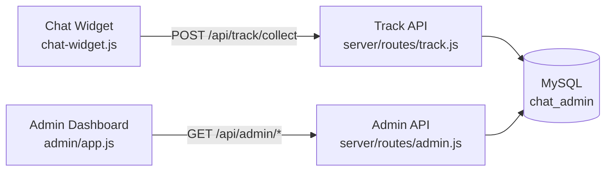
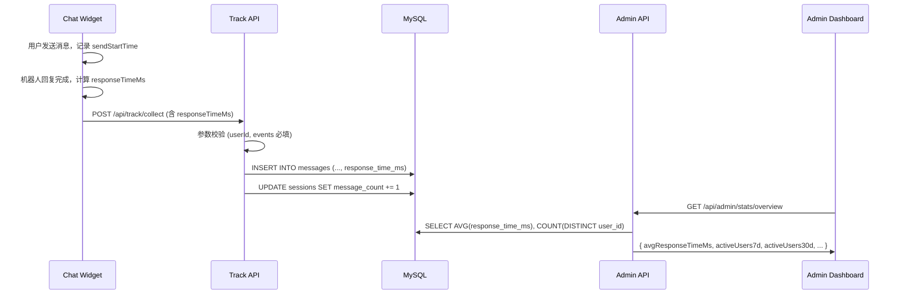
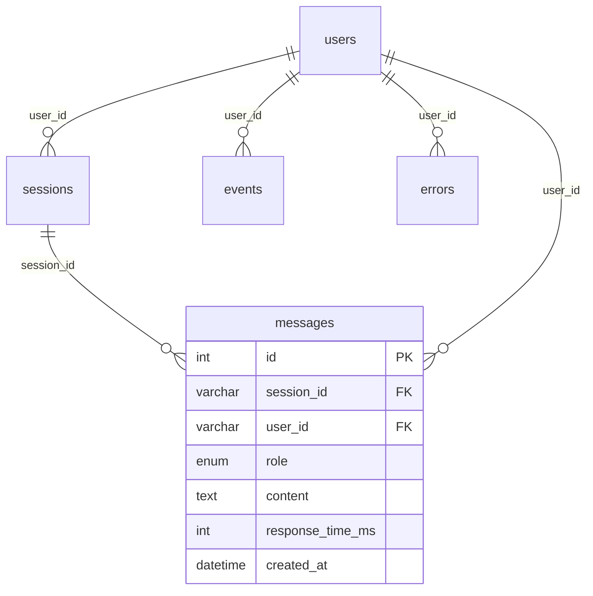

# 技术设计文档：Chat Analytics Sync

## 概述

本设计文档描述如何完善聊天悬浮球（Chat Widget）与管理后台之间的对话数据同步链路。当前系统已具备基础的埋点上报和后台展示能力，本次变更将补齐以下关键能力：

1. **响应时长埋点**：Chat Widget 在机器人回复完成时上报 `responseTimeMs`，Track API 持久化到 `messages.response_time_ms`
2. **统计指标增强**：Admin API 新增平均响应时长（全量 + 当日）、活跃用户数（7d / 30d）
3. **趋势数据扩展**：趋势接口新增每日平均响应时长维度
4. **管理后台展示**：概览页新增响应时长卡片、活跃用户卡片，趋势表格新增响应时长列
5. **埋点可靠性**：页面卸载时强制刷新队列、重复 session_start 去重、请求参数校验
6. **消息计数准确性**：会话列表优先使用 messages 表实际计数
7. **会话生命周期**：session_start / session_end 事件完整上报，后台展示开始/结束时间

### 变更范围

| 层级 | 文件 | 变更类型 |
|------|------|----------|
| 前端 Widget | `chat-widget.js` | 修改：响应时长上报、页面卸载刷新 |
| 后端 Track API | `server/routes/track.js` | 修改：参数校验增强 |
| 后端 Admin API | `server/routes/admin.js` | 修改：新增统计字段、趋势字段 |
| 后端数据库 | `server/db.js` | 修改：新增索引 |
| 管理后台 | `admin/app.js` | 修改：新增卡片、表格列、会话结束时间 |

## 架构

### 现有架构

系统采用经典的三层架构：



### 数据流



### 设计决策

1. **不新增数据库表**：所有需要的列已存在于现有 schema 中，只需确保正确写入和查询
2. **不新增 API 端点**：在现有 `/stats/overview` 和 `/stats/trend` 接口中扩展返回字段
3. **前端无新增依赖**：所有变更在现有 vanilla JS 代码基础上修改
4. **新增数据库索引**：为 `messages.user_id` 和 `messages.response_time_ms` 添加索引以优化聚合查询

## 组件与接口

### 1. Chat Widget（chat-widget.js）

#### 变更点

**响应时长上报（需求 1）**：
- 当前代码已在 `sendMessage()` 中计算 `responseTimeMs = Date.now() - sendStartTime` 并通过 `trackEvent` 上报
- 需要增加防御性处理：当 `sendStartTime` 无效时，将 `responseTimeMs` 设为 `null`

**页面卸载可靠性（需求 6.1, 6.2）**：
- 当前 `beforeunload` 已调用 `flushTrackQueue()`
- 当前 `flushTrackQueue()` 已优先使用 `navigator.sendBeacon`，降级使用 `fetch` + `keepalive: true`
- 现有实现已满足需求

**会话生命周期（需求 8.1, 8.2）**：
- 当前 `autoInit()` 已生成 `sessionId` 并上报 `session_start`
- 当前 `beforeunload` 已上报 `session_end`
- 现有实现已满足需求

#### Payload 结构（不变）

```javascript
{
  userId: string,
  sessionId: string,
  botId: string,
  pageUrl: string,
  referrer: string,
  device: { type: string, browser: string, os: string },
  events: [
    { type: 'message', role: 'bot', content: string, responseTimeMs: number | null },
    { type: 'session_start' },
    { type: 'session_end' },
    // ...
  ]
}
```

### 2. Track API（server/routes/track.js）

#### 变更点

**参数校验增强（需求 6.4）**：
- 当前已有 `if (!userId || !Array.isArray(events))` 校验
- 需要返回更具描述性的错误信息，区分缺少 `userId` 和缺少 `events`

```javascript
// 增强后的校验逻辑
if (!userId) {
  return res.status(400).json({ code: -1, message: '参数缺失: userId 为必填项' });
}
if (!Array.isArray(events) || events.length === 0) {
  return res.status(400).json({ code: -1, message: '参数缺失: events 必须为非空数组' });
}
```

**其他现有实现已满足需求**：
- 重复 session_start 去重：`INSERT IGNORE INTO sessions` 已处理（需求 6.3）
- 消息计数递增：`UPDATE sessions SET message_count = message_count + 1` 已处理（需求 7.1）
- session_end 处理：`UPDATE sessions SET ended_at = NOW()` 已处理（需求 8.3）
- response_time_ms 存储：`INSERT INTO messages (..., response_time_ms)` 已处理（需求 1.2）

### 3. Admin API（server/routes/admin.js）

#### 概览统计增强（需求 2 + 需求 3）

`GET /api/admin/stats/overview` 返回新增字段：

```javascript
{
  code: 0,
  data: {
    // 现有字段
    totalUsers, totalSessions, totalMessages, totalErrors,
    todayUsers, todaySessions, todayMessages, avgMessagesPerSession,
    // 新增字段
    avgResponseTimeMs: number,       // 全量平均响应时长 (ms)，无数据时为 0
    todayAvgResponseTimeMs: number,  // 当日平均响应时长 (ms)，无数据时为 0
    activeUsers7d: number,           // 7 日活跃用户数
    activeUsers30d: number           // 30 日活跃用户数
  }
}
```

新增 SQL：

```sql
-- 全量平均响应时长（仅统计 response_time_ms 不为 null 且大于 0）
SELECT COALESCE(AVG(response_time_ms), 0) as avg
FROM messages WHERE response_time_ms IS NOT NULL AND response_time_ms > 0

-- 当日平均响应时长
SELECT COALESCE(AVG(response_time_ms), 0) as avg
FROM messages WHERE response_time_ms IS NOT NULL AND response_time_ms > 0
  AND created_at >= CURDATE()

-- 7 日活跃用户（基于 messages 表 role='user' 按 user_id 去重）
SELECT COUNT(DISTINCT user_id) as count
FROM messages WHERE role = 'user'
  AND created_at >= DATE_SUB(CURDATE(), INTERVAL 7 DAY)

-- 30 日活跃用户
SELECT COUNT(DISTINCT user_id) as count
FROM messages WHERE role = 'user'
  AND created_at >= DATE_SUB(CURDATE(), INTERVAL 30 DAY)
```

#### 趋势数据增强（需求 5）

`GET /api/admin/stats/trend` 每日数据新增 `avgResponseTime` 字段：

```javascript
[
  { date: '2024-01-15', users: 10, sessions: 15, messages: 45, avgResponseTime: 1200 },
  // ...
]
```

在现有 CTE 查询中增加 LEFT JOIN：

```sql
LEFT JOIN (
  SELECT DATE(created_at) as d,
         COALESCE(AVG(response_time_ms), 0) as avg_rt
  FROM messages
  WHERE response_time_ms IS NOT NULL AND response_time_ms > 0
  GROUP BY DATE(created_at)
) rt ON dates.d = rt.d
```

SELECT 中新增：`COALESCE(rt.avg_rt, 0) as avgResponseTime`

#### 会话列表（需求 7.2, 7.3, 8.4）

- 当前已通过子查询获取 `actual_msg_count`（满足需求 7.2、7.3）
- `SELECT s.*` 已包含 `ended_at` 字段（满足需求 8.4）

### 4. Admin Dashboard（admin/app.js）

#### 概览页卡片增强（需求 4）

新增统计卡片：
- **平均响应时长**：显示 `Math.round(stats.avgResponseTimeMs)` + " ms"，副标题 "今日 " + `Math.round(stats.todayAvgResponseTimeMs)` + " ms"
- 当 `avgResponseTimeMs > 5000` 时，数值颜色设为红色
- **7 日活跃用户**：显示 `stats.activeUsers7d`
- **30 日活跃用户**：显示 `stats.activeUsers30d`

#### 趋势表格增强（需求 5.2）

表头新增"平均响应时长"列，单元格显示 `Math.round(row.avgResponseTime)` + " ms"

#### 会话列表增强（需求 8.4）

表头新增"结束时间"列，显示 `s.ended_at`

### 5. 数据库索引优化（server/db.js）

在 `initDB()` 中新增索引创建语句：

```sql
CREATE INDEX IF NOT EXISTS idx_messages_user_id ON messages(user_id);
CREATE INDEX IF NOT EXISTS idx_messages_response_time ON messages(response_time_ms);
```

## 数据模型

### 现有表结构（无需修改）

| 表 | 关键列 | 说明 |
|---|--------|------|
| `users` | `user_id`, `first_seen_at`, `last_seen_at` | 用户表 |
| `sessions` | `session_id`, `user_id`, `message_count`, `started_at`, `ended_at` | 会话表 |
| `messages` | `session_id`, `user_id`, `role`, `content`, `response_time_ms`, `created_at` | 消息表 |
| `events` | `user_id`, `session_id`, `event_type`, `event_data` | 通用事件表 |
| `errors` | `user_id`, `session_id`, `error_type`, `error_message` | 错误表 |

### 新增索引

| 表 | 索引名 | 列 | 用途 |
|---|--------|---|------|
| `messages` | `idx_messages_user_id` | `user_id` | 加速活跃用户统计查询 |
| `messages` | `idx_messages_response_time` | `response_time_ms` | 加速响应时长聚合查询 |

### 数据流转关系



## 正确性属性（Correctness Properties）

*正确性属性是一种在系统所有有效执行中都应成立的特征或行为——本质上是对系统应做什么的形式化陈述。属性是人类可读规格说明与机器可验证正确性保证之间的桥梁。*

### Property 1: 响应时长计算正确性

*For any* 用户消息发送时间戳 `sendStartTime` 和机器人回复完成时间戳 `completionTime`（其中 `completionTime >= sendStartTime`），计算得到的 `responseTimeMs` 应等于 `completionTime - sendStartTime`，且结果为非负整数。

**Validates: Requirements 1.1**

### Property 2: 平均响应时长仅统计有效记录

*For any* 消息集合（包含 `response_time_ms` 为 null、0、负数和正整数的混合记录），计算得到的平均响应时长应等于所有 `response_time_ms > 0` 且非 null 记录的算术平均值。当没有有效记录时，结果应为 0。

**Validates: Requirements 2.1, 2.2, 2.3, 2.4, 5.1, 5.3**

### Property 3: 活跃用户按时间窗口去重计数

*For any* 消息集合和时间窗口 N 天，活跃用户数应等于该时间窗口内 `role = 'user'` 的消息中不同 `user_id` 的数量。同一用户发送多条消息只计数一次，`role = 'bot'` 的消息不参与计数。

**Validates: Requirements 3.1, 3.2, 3.3**

### Property 4: Session Start 幂等性

*For any* `session_id`，重复发送 `session_start` 事件不应创建重复的会话记录。数据库中该 `session_id` 对应的会话记录始终只有一条。

**Validates: Requirements 6.3**

### Property 5: 缺失必要字段的请求被拒绝

*For any* 请求体，若缺少 `userId` 字段或 `events` 不是非空数组，Track API 应返回 HTTP 400 状态码和包含描述性信息的错误响应，且不应写入任何数据。

**Validates: Requirements 6.4**

### Property 6: 消息实际计数一致性

*For any* 会话，Admin API 返回的消息计数应等于 `messages` 表中该会话的实际消息记录数，而非 `sessions` 表中的 `message_count` 字段值。

**Validates: Requirements 7.1, 7.2, 7.3**

### Property 7: Session ID 唯一性

*For any* 两次独立的 Chat Widget 初始化，生成的 `session_id` 应互不相同。

**Validates: Requirements 8.1**

### Property 8: Session End 更新结束时间

*For any* 已创建的会话，当接收到 `session_end` 事件后，该会话的 `ended_at` 字段应从 null 变为非 null 的有效时间戳。

**Validates: Requirements 8.2, 8.3**

## 错误处理

### 前端（Chat Widget）

| 场景 | 处理方式 |
|------|----------|
| `responseTimeMs` 计算异常（NaN/Infinity） | 设为 `null`，不上报错误值 |
| `sendBeacon` 调用失败 | 降级使用 `fetch` + `keepalive: true` |
| `fetch` 降级也失败 | 静默忽略，不影响主聊天流程 |
| 埋点队列为空 | `flushTrackQueue()` 直接返回，不发送请求 |

### 后端（Track API）

| 场景 | HTTP 状态码 | 响应 |
|------|------------|------|
| 缺少 `userId` | 400 | `{ code: -1, message: '参数缺失: userId 为必填项' }` |
| `events` 不是数组或为空 | 400 | `{ code: -1, message: '参数缺失: events 必须为非空数组' }` |
| 重复 `session_start` | 200 | 静默忽略（`INSERT IGNORE`），正常返回 |
| 数据库写入失败 | 500 | 事务回滚，返回 `{ code: -1, message: '服务器错误' }` |

### 后端（Admin API）

| 场景 | 处理方式 |
|------|----------|
| 无有效响应时长记录 | `avgResponseTimeMs` 和 `todayAvgResponseTimeMs` 返回 0（`COALESCE`） |
| 无活跃用户 | `activeUsers7d` 和 `activeUsers30d` 返回 0 |
| 趋势数据某日无记录 | 该日 `avgResponseTime` 返回 0 |
| 数据库查询失败 | 返回 500 + 错误信息 |

## 测试策略

### 单元测试

使用项目现有的 Node.js 生态，推荐使用 **Vitest** 作为测试框架。

| 测试目标 | 测试内容 | 类型 |
|----------|----------|------|
| 响应时长计算 | `Date.now() - sendStartTime` 在各种时间差下的正确性 | 示例测试 |
| 响应时长异常处理 | `sendStartTime` 为 undefined/NaN 时返回 null | 边界测试 |
| 参数校验 | 缺少 userId、events 为空数组、events 非数组 | 示例测试 |
| 平均响应时长 SQL | 混合 null/0/正值记录的平均值计算 | 示例测试 |
| 活跃用户 SQL | 跨日期、混合角色的去重计数 | 示例测试 |
| 趋势数据 | 多日数据含/不含有效响应时长 | 示例测试 |
| 红色告警阈值 | avgResponseTimeMs > 5000 时的样式判断 | 示例测试 |

### 属性测试（Property-Based Testing）

使用 **fast-check** 库进行属性测试，每个属性测试至少运行 100 次迭代。

| 属性 | 测试策略 | 标签 |
|------|----------|------|
| Property 1 | 生成随机时间戳对，验证差值计算 | Feature: chat-analytics-sync, Property 1: 响应时长计算正确性 |
| Property 2 | 生成混合 response_time_ms 值的消息集合，验证平均值过滤逻辑 | Feature: chat-analytics-sync, Property 2: 平均响应时长仅统计有效记录 |
| Property 3 | 生成随机用户消息集合（含不同 role 和日期），验证去重计数 | Feature: chat-analytics-sync, Property 3: 活跃用户按时间窗口去重计数 |
| Property 4 | 生成随机 session_id，重复插入验证幂等性 | Feature: chat-analytics-sync, Property 4: Session Start 幂等性 |
| Property 5 | 生成随机缺失字段的请求体，验证 400 响应 | Feature: chat-analytics-sync, Property 5: 缺失必要字段的请求被拒绝 |
| Property 6 | 生成随机消息序列，验证实际计数与查询结果一致 | Feature: chat-analytics-sync, Property 6: 消息实际计数一致性 |
| Property 7 | 生成多个 session_id，验证唯一性 | Feature: chat-analytics-sync, Property 7: Session ID 唯一性 |
| Property 8 | 生成随机会话并发送 session_end，验证 ended_at 更新 | Feature: chat-analytics-sync, Property 8: Session End 更新结束时间 |

### 集成测试

| 测试目标 | 测试内容 |
|----------|----------|
| 端到端数据流 | 模拟 Chat Widget 上报 → Track API 写入 → Admin API 查询，验证数据一致性 |
| 页面卸载上报 | Mock `sendBeacon` 和 `fetch`，验证 `beforeunload` 触发数据发送 |
| sendBeacon 降级 | Mock `sendBeacon` 为 undefined，验证 `fetch` + `keepalive` 被调用 |
| 概览页渲染 | Mock API 响应，验证新增卡片和条件样式正确渲染 |
