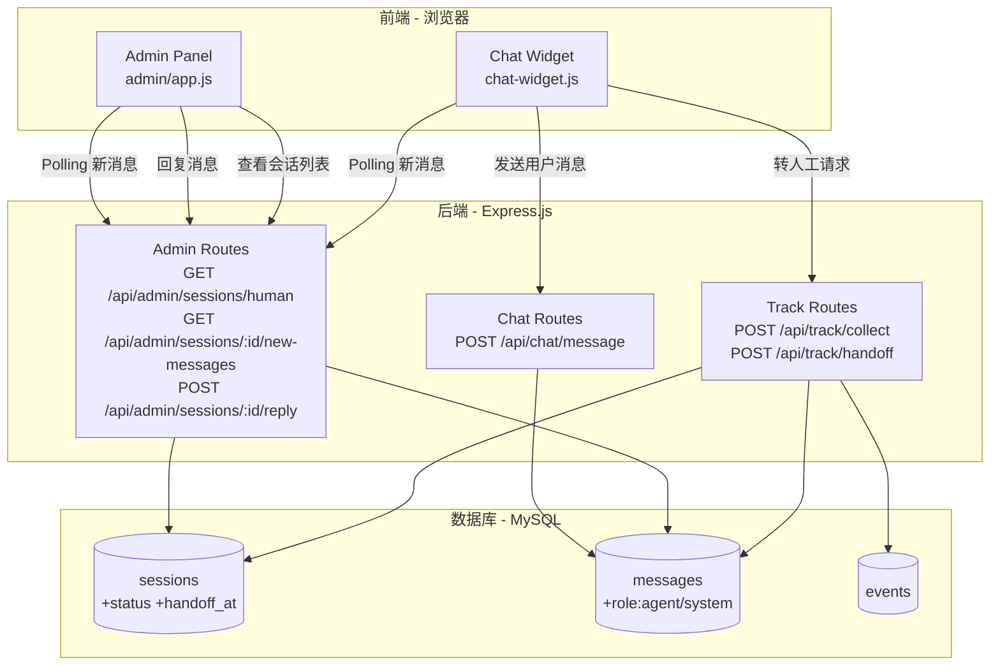
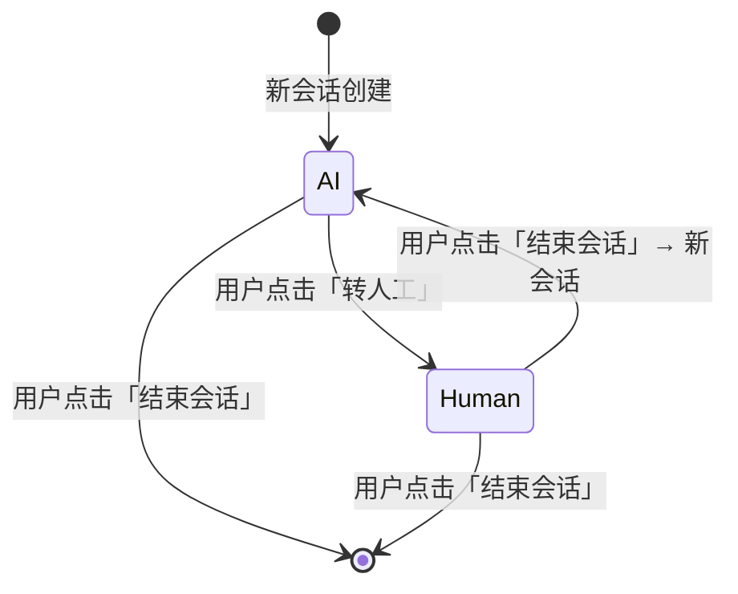
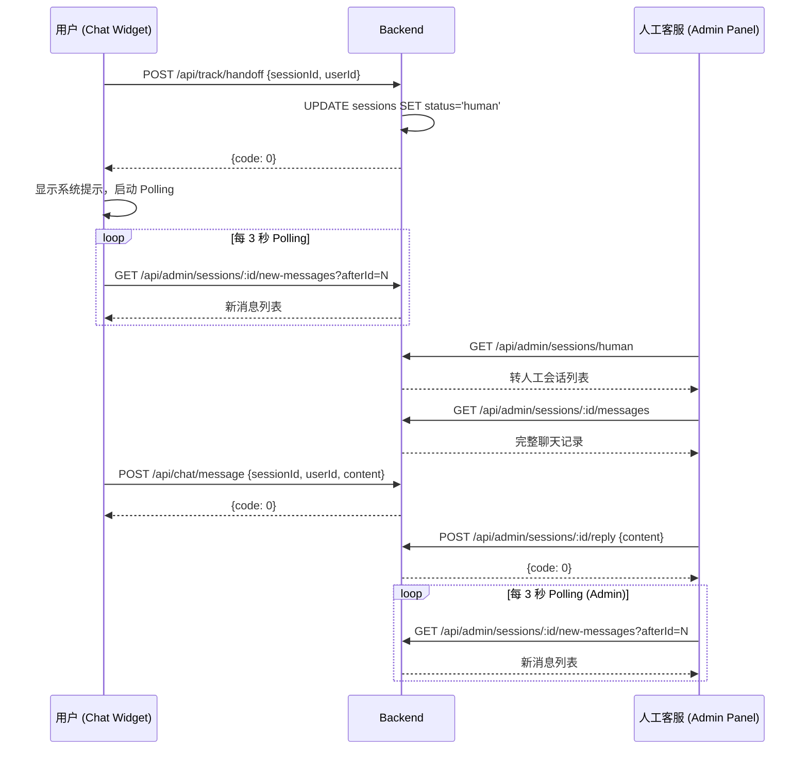

# Design Document: Human Handoff & Session Control

## Overview

本设计为现有 AI 聊天悬浮球系统新增「转人工」和「结束会话」功能。系统采用三层架构：前端 Chat Widget（纯 JS IIFE）、Express.js 后端 REST API、MySQL 数据库。核心变更包括：

1. **Chat Widget 扩展**：在聊天窗口 header 区域新增「转人工」和「结束会话」按钮，支持会话模式切换（AI ↔ 人工），通过 Polling 机制（3s 间隔）实现人工客服消息的近实时接收。
2. **管理后台新增页面**：新增「人工客服」页面，客服人员可查看待处理会话列表、查看完整聊天记录、实时回复用户消息。
3. **后端 API 扩展**：新增转人工、消息收发、会话状态查询等 REST 接口，扩展数据库 schema 以支持会话状态和人工客服消息。
4. **数据统计更新**：概览统计和趋势数据新增转人工相关指标。

### 设计决策

- **Polling 而非 WebSocket**：保持与现有架构一致，使用 3 秒间隔的 HTTP Polling 实现消息更新，降低实现复杂度。
- **messages 表 role 字段扩展**：将 ENUM('user','bot') 改为 ENUM('user','bot','agent','system')，新增 'agent'（人工客服）和 'system'（系统提示）角色。
- **会话状态管理**：在 sessions 表新增 status 和 handoff_at 字段，通过 status 字段控制 AI/人工模式切换。
- **前端状态管理**：在 Chat Widget IIFE 闭包内新增 sessionMode 变量和 pollingTimer 引用，控制消息收发行为。

## Architecture

### 系统架构图



### 会话状态流转



### 消息 Polling 时序图



## Components and Interfaces

### 1. Chat Widget 扩展 (chat-widget.js)

#### 新增闭包变量

```javascript
var sessionMode = 'ai';       // 'ai' | 'human' — 当前会话模式
var pollingTimer = null;       // Polling 定时器引用
var lastMessageId = 0;         // Polling 用：最后一条已接收消息的 ID
var pollingFailCount = 0;      // Polling 连续失败计数
var POLLING_INTERVAL = 3000;   // 正常 Polling 间隔 (ms)
var POLLING_SLOW_INTERVAL = 10000; // 降级 Polling 间隔 (ms)
var POLLING_FAIL_THRESHOLD = 3;    // 触发降级的连续失败次数
```

#### 新增函数签名

```javascript
/**
 * 发起转人工请求
 * - 调用 POST /api/track/handoff
 * - 成功后切换 sessionMode 为 'human'，显示系统提示，启动 Polling
 * - 失败后显示错误提示
 */
function requestHandoff() { ... }

/**
 * 结束当前会话并创建新会话
 * - 停止 Polling，上报 session_end 事件
 * - 生成新 sessionId，清空 chatHistory 和消息 DOM
 * - 重置 sessionMode 为 'ai'，显示欢迎消息和快捷操作
 * - 上报 session_start 和 session_reset 事件
 */
function resetSession() { ... }

/**
 * 启动 Polling 定时器，定期获取新消息
 * - 调用 GET /api/admin/sessions/:sessionId/new-messages?afterId=lastMessageId
 * - 将新消息以 'agent' 角色样式渲染到聊天窗口
 * - 连续失败 3 次后降级为 10 秒间隔并显示提示
 */
function startPolling() { ... }

/**
 * 停止 Polling 定时器
 */
function stopPolling() { ... }

/**
 * 执行一次 Polling 请求
 * - 成功时重置失败计数，渲染新消息
 * - 失败时递增失败计数，达到阈值后降级
 */
function pollNewMessages() { ... }

/**
 * 在 human 模式下发送用户消息
 * - 调用 POST /api/chat/message
 * - 不调用 streamChat，仅存储消息
 */
function sendHumanModeMessage(text) { ... }

/**
 * 渲染系统提示消息（如「已转接人工客服，请稍候...」）
 * @param {string} text - 提示文本
 */
function appendSystemMessage(text) { ... }
```

#### sendMessage 函数修改

现有 `sendMessage()` 函数需要根据 `sessionMode` 分支：
- `sessionMode === 'ai'`：保持现有逻辑，调用 `streamChat()`
- `sessionMode === 'human'`：调用 `sendHumanModeMessage()`，不触发 AI 流式接口

#### buildWidget 函数修改

在 `chat-header` 区域新增两个按钮：
```html
<button class="header-handoff-btn" aria-label="转人工">转人工</button>
<button class="header-end-btn" aria-label="结束会话">结束会话</button>
```

按钮样式与现有 `header-close` 按钮风格一致，使用半透明白色背景。

### 2. 后端新增路由

#### 2.1 POST /api/track/handoff — 转人工接口

```javascript
/**
 * 将会话状态从 'ai' 切换为 'human'
 * @route POST /api/track/handoff
 * @body {string} sessionId - 会话 ID
 * @body {string} userId - 用户 ID
 * @returns {object} { code: 0, message: 'ok' }
 * @error 400 - 参数缺失
 * @error 404 - sessionId 不存在
 * @error 500 - 服务器错误
 */
router.post('/handoff', async (req, res) => { ... });
```

实现逻辑：
1. 校验 sessionId 和 userId 参数
2. 查询 sessions 表确认 sessionId 存在
3. 更新 sessions 表：`SET status = 'human', handoff_at = NOW()`
4. 在 events 表记录 handoff_to_human 事件
5. 返回成功响应

#### 2.2 POST /api/chat/message — 用户消息发送接口

```javascript
/**
 * 在 human 模式下存储用户消息
 * @route POST /api/chat/message
 * @body {string} sessionId - 会话 ID
 * @body {string} userId - 用户 ID
 * @body {string} content - 消息内容
 * @returns {object} { code: 0, data: { id, created_at } }
 * @error 400 - 参数缺失
 * @error 500 - 服务器错误
 */
router.post('/message', async (req, res) => { ... });
```

实现逻辑：
1. 校验 sessionId、userId、content 参数
2. 插入 messages 表：role='user'
3. 更新 sessions 表 message_count
4. 返回新消息的 id 和 created_at

#### 2.3 GET /api/admin/sessions/human — 转人工会话列表

```javascript
/**
 * 获取所有 status='human' 的会话列表
 * @route GET /api/admin/sessions/human
 * @returns {object} { code: 0, data: [{ session_id, user_id, message_count, handoff_at, last_message }] }
 */
router.get('/sessions/human', async (req, res) => { ... });
```

实现逻辑：
1. 查询 sessions 表 WHERE status='human'，按 handoff_at DESC 排序
2. 对每个会话关联查询最后一条消息作为预览
3. 关联查询未读消息数（agent 最后回复之后的 user 消息数）

#### 2.4 GET /api/admin/sessions/:sessionId/new-messages — 增量消息查询

```javascript
/**
 * 获取指定 session 中 id > afterId 的新消息
 * @route GET /api/admin/sessions/:sessionId/new-messages
 * @query {number} afterId - 起始消息 ID（不含）
 * @returns {object} { code: 0, data: [{ id, role, content, created_at }] }
 */
router.get('/sessions/:sessionId/new-messages', async (req, res) => { ... });
```

#### 2.5 POST /api/admin/sessions/:sessionId/reply — 客服回复接口

```javascript
/**
 * 人工客服发送回复消息
 * @route POST /api/admin/sessions/:sessionId/reply
 * @body {string} content - 回复内容
 * @returns {object} { code: 0, data: { id, created_at } }
 * @error 400 - content 为空
 * @error 404 - sessionId 不存在
 */
router.post('/sessions/:sessionId/reply', async (req, res) => { ... });
```

实现逻辑：
1. 校验 content 非空
2. 查询 sessions 表确认 sessionId 存在
3. 从 sessions 表获取 user_id
4. 插入 messages 表：role='agent'
5. 更新 sessions 表 message_count

### 3. 管理后台新增页面 (admin/app.js)

#### 路由扩展

```javascript
// validPages 数组新增 'human-service'
var validPages = ['overview', 'sessions', 'users', 'errors', 'human-service'];
```

#### 新增渲染函数

```javascript
/**
 * 渲染人工客服页面 — 会话列表 + 聊天面板
 * 左侧：转人工会话列表（按 handoff_at 倒序）
 * 右侧：选中会话的聊天记录 + 回复输入框
 */
function renderHumanService() { ... }

/**
 * 渲染人工客服聊天面板
 * - 显示完整聊天记录（user/bot/agent 三种角色样式）
 * - 底部输入框 + 发送按钮
 * - 启动 3 秒 Polling 刷新新消息
 * @param {string} sessionId - 会话 ID
 */
function renderHumanServiceChat(sessionId) { ... }

/**
 * 发送客服回复
 * @param {string} sessionId - 会话 ID
 * @param {string} content - 回复内容
 */
function sendAgentReply(sessionId, content) { ... }
```

#### 概览页扩展

在 `renderOverview()` 中新增统计卡片：
- 「转人工会话」：显示 totalHumanSessions
- 「转人工率」：显示 humanHandoffRate（百分比格式）

趋势表格新增「转人工数」列。

#### 会话列表扩展

在 `renderSessions()` 的表格中新增「状态」列，显示 AI/人工 标签。

### 4. 统计接口扩展

#### GET /api/admin/stats/overview 新增字段

```javascript
// 新增查询
const [[{ count: totalHumanSessions }]] = await pool.query(
  `SELECT COUNT(*) as count FROM sessions WHERE status = 'human'`
);
const [[{ count: todayHumanSessions }]] = await pool.query(
  `SELECT COUNT(*) as count FROM sessions WHERE status = 'human' AND handoff_at >= CURDATE()`
);

// 返回数据新增
{
  totalHumanSessions,
  todayHumanSessions,
  humanHandoffRate: totalSessions > 0
    ? Math.round((totalHumanSessions / totalSessions) * 1000) / 10
    : 0
}
```

#### GET /api/admin/stats/trend 新增字段

在趋势查询中新增 LEFT JOIN：
```sql
LEFT JOIN (
  SELECT DATE(handoff_at) as d, COUNT(*) as human_count
  FROM sessions WHERE status = 'human' AND handoff_at IS NOT NULL
  GROUP BY DATE(handoff_at)
) h ON dates.d = h.d
```

返回每行新增 `humanSessions` 字段。

#### GET /api/admin/sessions 新增字段

在会话列表查询中新增 `s.status` 和 `s.handoff_at` 字段。

## Data Models

### 数据库 Schema 变更

#### 1. sessions 表 — 新增字段

```sql
-- 新增 status 字段：会话状态
ALTER TABLE sessions
  ADD COLUMN status VARCHAR(10) NOT NULL DEFAULT 'ai'
  COMMENT '会话状态: ai=AI对话, human=人工客服';

-- 新增 handoff_at 字段：转人工时间
ALTER TABLE sessions
  ADD COLUMN handoff_at DATETIME DEFAULT NULL
  COMMENT '转人工时间戳';

-- 新增索引：优化按状态查询
CREATE INDEX idx_sessions_status ON sessions(status);

-- 新增索引：优化按转人工时间排序
CREATE INDEX idx_sessions_handoff_at ON sessions(handoff_at);
```

#### 2. messages 表 — 扩展 role 字段

```sql
-- 扩展 role ENUM 以支持 agent 和 system 角色
ALTER TABLE messages
  MODIFY COLUMN role ENUM('user', 'bot', 'agent', 'system') NOT NULL
  COMMENT 'user=用户, bot=AI, agent=人工客服, system=系统提示';
```

#### 3. initDB 函数更新

在 `server/db.js` 的 `initDB()` 函数中：

```javascript
// sessions 表建表语句新增字段
CREATE TABLE IF NOT EXISTS sessions (
  id INT AUTO_INCREMENT PRIMARY KEY,
  session_id VARCHAR(255) UNIQUE NOT NULL,
  user_id VARCHAR(255) NOT NULL,
  bot_id VARCHAR(255),
  page_url TEXT,
  referrer TEXT,
  started_at DATETIME NOT NULL DEFAULT CURRENT_TIMESTAMP,
  ended_at DATETIME,
  message_count INT DEFAULT 0,
  device_type VARCHAR(50),
  browser VARCHAR(100),
  os VARCHAR(100),
  status VARCHAR(10) NOT NULL DEFAULT 'ai',
  handoff_at DATETIME DEFAULT NULL,
  INDEX idx_sessions_user_id (user_id),
  INDEX idx_sessions_status (status),
  INDEX idx_sessions_handoff_at (handoff_at)
);

// messages 表建表语句修改 role 字段
CREATE TABLE IF NOT EXISTS messages (
  id INT AUTO_INCREMENT PRIMARY KEY,
  session_id VARCHAR(255) NOT NULL,
  user_id VARCHAR(255) NOT NULL,
  role ENUM('user', 'bot', 'agent', 'system') NOT NULL,
  content TEXT NOT NULL,
  created_at DATETIME NOT NULL DEFAULT CURRENT_TIMESTAMP,
  response_time_ms INT,
  INDEX idx_messages_session_id (session_id),
  INDEX idx_messages_created_at (created_at)
);

// 对已有数据库执行迁移（在 initDB 中检测并添加字段）
async function migrateDB(conn) {
  // 检查 sessions 表是否有 status 字段
  const [columns] = await conn.query(`SHOW COLUMNS FROM sessions LIKE 'status'`);
  if (columns.length === 0) {
    await conn.query(`ALTER TABLE sessions ADD COLUMN status VARCHAR(10) NOT NULL DEFAULT 'ai'`);
    await conn.query(`ALTER TABLE sessions ADD COLUMN handoff_at DATETIME DEFAULT NULL`);
    await conn.query(`CREATE INDEX idx_sessions_status ON sessions(status)`);
    await conn.query(`CREATE INDEX idx_sessions_handoff_at ON sessions(handoff_at)`);
  }

  // 检查 messages 表 role 字段是否包含 'agent'
  const [roleCol] = await conn.query(`SHOW COLUMNS FROM messages LIKE 'role'`);
  if (roleCol.length > 0 && roleCol[0].Type.indexOf('agent') === -1) {
    await conn.query(`ALTER TABLE messages MODIFY COLUMN role ENUM('user','bot','agent','system') NOT NULL`);
  }
}
```

### 数据流

| 操作 | 前端 | API | 数据库变更 |
|------|------|-----|-----------|
| 转人工 | Chat Widget → POST /api/track/handoff | 更新 session status, handoff_at | sessions.status='human', sessions.handoff_at=NOW() |
| 用户发消息(human) | Chat Widget → POST /api/chat/message | 插入 message | messages(role='user'), sessions.message_count++ |
| 客服回复 | Admin Panel → POST /api/admin/sessions/:id/reply | 插入 message | messages(role='agent'), sessions.message_count++ |
| Polling 新消息 | Chat Widget / Admin → GET /api/admin/sessions/:id/new-messages | 查询 messages | 无变更 |
| 结束会话 | Chat Widget → POST /api/track/collect (session_end) | 更新 session ended_at | sessions.ended_at=NOW() |

## Correctness Properties

*A property is a characteristic or behavior that should hold true across all valid executions of a system — essentially, a formal statement about what the system should do. Properties serve as the bridge between human-readable specifications and machine-verifiable correctness guarantees.*

### Property 1: Handoff updates session state

*For any* existing session with status='ai', calling the handoff endpoint with that session's sessionId should result in the session's status being updated to 'human' and handoff_at being set to a non-null datetime value.

**Validates: Requirements 1.3, 5.3**

### Property 2: Human mode blocks AI streaming

*For any* message text sent while sessionMode is 'human', the system should route the message to the human-mode message storage path (POST /api/chat/message) and never invoke the AI streaming interface (streamChat).

**Validates: Requirements 1.5**

### Property 3: New-messages endpoint filters by afterId

*For any* session containing N messages (N ≥ 0) and any afterId value (0 ≤ afterId ≤ max message id), the GET /api/admin/sessions/:sessionId/new-messages?afterId=X endpoint should return exactly those messages whose id > afterId, ordered by id ASC.

**Validates: Requirements 2.5, 5.5**

### Property 4: Session reset produces fresh state

*For any* prior session state (any sessionId, any number of messages in chatHistory, any sessionMode), calling resetSession should produce a new sessionId different from the original, an empty chatHistory array, and sessionMode reset to 'ai'.

**Validates: Requirements 3.3**

### Property 5: Human sessions filter and ordering

*For any* set of sessions with mixed statuses ('ai' and 'human'), the GET /api/admin/sessions/human endpoint should return only sessions where status='human', and the results should be ordered by handoff_at in descending order.

**Validates: Requirements 4.2, 5.8**

### Property 6: Message storage preserves role

*For any* non-empty message content string, when stored via POST /api/chat/message (role='user') or POST /api/admin/sessions/:id/reply (role='agent'), the resulting row in the messages table should have the exact content and the correct role value.

**Validates: Requirements 2.4, 4.6, 5.6, 5.9**

### Property 7: Human session statistics accuracy

*For any* set of sessions in the database with mixed statuses and handoff_at timestamps, the overview stats endpoint should return: (a) totalHumanSessions equal to the count of sessions where status='human', (b) todayHumanSessions equal to the count of sessions where status='human' AND handoff_at >= today, and (c) humanHandoffRate equal to totalHumanSessions / totalSessions (or 0 if totalSessions is 0).

**Validates: Requirements 6.1, 6.2, 6.3**

## Error Handling

### 前端 (Chat Widget)

| 场景 | 处理方式 |
|------|---------|
| 转人工请求失败 (网络错误/服务端错误) | 显示系统提示「转接人工客服失败，请稍后重试」，不改变 sessionMode |
| Polling 单次失败 | 静默重试，递增 pollingFailCount |
| Polling 连续失败 3 次 | 显示提示「连接中断，正在重试...」，Polling 间隔从 3s 延长至 10s |
| Polling 恢复成功 | 重置 pollingFailCount 为 0，恢复 3s 间隔，移除中断提示 |
| 用户消息发送失败 (human 模式) | 显示错误提示「消息发送失败，请重试」，不清空输入框 |
| 结束会话时网络错误 | 仍然在本地重置会话状态（生成新 sessionId、清空历史），下次上报时补发 |

### 后端 (Express.js)

| 场景 | HTTP 状态码 | 响应 |
|------|------------|------|
| handoff 缺少 sessionId 或 userId | 400 | `{ code: -1, message: '参数缺失: sessionId 和 userId 为必填项' }` |
| handoff 的 sessionId 不存在 | 404 | `{ code: -1, message: '会话不存在' }` |
| reply 的 content 为空 | 400 | `{ code: -1, message: '参数缺失: content 为必填项' }` |
| reply 的 sessionId 不存在 | 404 | `{ code: -1, message: '会话不存在' }` |
| chat/message 缺少必填参数 | 400 | `{ code: -1, message: '参数缺失' }` |
| 数据库操作异常 | 500 | `{ code: -1, message: '服务器错误' }` |
| new-messages 的 afterId 非数字 | 使用默认值 0 | 返回该 session 的所有消息 |

### 管理后台 (Admin Panel)

| 场景 | 处理方式 |
|------|---------|
| 人工客服页面加载失败 | 显示错误状态页「加载失败: {错误信息}」 |
| 客服回复发送失败 | 在输入框上方显示红色错误提示，不清空输入框内容 |
| Polling 失败 | 静默重试，不影响已显示的聊天记录 |
| 会话列表为空 | 显示空状态页「暂无转人工会话」 |

## Testing Strategy

### 测试框架

- **单元测试 & 属性测试**：Vitest + fast-check（已在项目中配置）
- **测试目录**：`server/__tests__/`
- **运行命令**：`npm test`（即 `vitest --run`）

### 属性测试 (Property-Based Testing)

本功能适合属性测试，因为：
- 后端 API 是纯函数式的请求/响应模式，有明确的输入/输出
- 消息过滤、会话状态转换、统计计算等逻辑在不同输入下应保持一致的行为
- 输入空间较大（不同的 sessionId、userId、content、afterId 组合）

**PBT 配置**：
- 库：fast-check（已安装）
- 每个属性测试最少 100 次迭代
- 标签格式：`Feature: human-handoff-session-control, Property {N}: {property_text}`

**属性测试覆盖**：

| 属性 | 测试文件 | 说明 |
|------|---------|------|
| Property 1: Handoff updates session state | handoff.test.js | 生成随机 sessionId，验证 handoff 后 status 和 handoff_at 正确 |
| Property 2: Human mode blocks AI streaming | message-routing.test.js | 生成随机消息文本，验证 human 模式下不调用 streamChat |
| Property 3: New-messages filters by afterId | new-messages.test.js | 生成随机消息集合和 afterId，验证过滤结果正确 |
| Property 4: Session reset produces fresh state | session-reset.test.js | 生成随机初始状态，验证 reset 后状态完全刷新 |
| Property 5: Human sessions filter and ordering | human-sessions.test.js | 生成混合状态的会话集合，验证过滤和排序 |
| Property 6: Message storage preserves role | message-storage.test.js | 生成随机 content，验证存储后 role 和 content 一致 |
| Property 7: Human session statistics accuracy | stats.test.js | 生成随机会话数据，验证统计字段数学正确性 |

### 单元测试 (Example-Based)

| 测试场景 | 类型 | 说明 |
|---------|------|------|
| 转人工按钮存在于 header | EXAMPLE | 验证 DOM 结构 |
| 转人工成功后显示系统提示 | EXAMPLE | 验证具体提示文本 |
| 转人工按钮在 human 模式下禁用 | EXAMPLE | 验证 disabled 属性 |
| 转人工失败显示错误提示 | EXAMPLE | 验证错误提示文本 |
| handoff_to_human 埋点事件 | EXAMPLE | 验证 trackEvent 调用 |
| 结束会话按钮存在于 header | EXAMPLE | 验证 DOM 结构 |
| 结束会话上报 session_end | EXAMPLE | 验证事件上报 |
| 新会话显示欢迎消息 | EXAMPLE | 验证 UI 状态 |
| session_start 事件上报 | EXAMPLE | 验证事件上报 |
| session_reset 事件上报 | EXAMPLE | 验证事件上报 |
| 侧边栏包含人工客服菜单 | EXAMPLE | 验证 DOM 结构 |
| 概览页新增统计卡片 | EXAMPLE | 验证 DOM 结构 |
| 趋势表格新增转人工列 | EXAMPLE | 验证表头 |
| 会话列表显示状态标签 | EXAMPLE | 验证 DOM 结构 |

### 边界测试 (Edge Cases)

| 测试场景 | 说明 |
|---------|------|
| handoff 不存在的 sessionId | 验证返回 404 |
| Polling 连续失败 3 次降级 | 验证间隔从 3s 变为 10s |
| reply 空 content | 验证返回 400 |
| new-messages afterId 为 0 | 验证返回所有消息 |
| new-messages afterId 大于最大 id | 验证返回空数组 |
| 无会话时 humanHandoffRate 为 0 | 验证除零保护 |

### 集成测试

| 测试场景 | 说明 |
|---------|------|
| 完整转人工流程 | 创建会话 → 转人工 → 客服回复 → 用户收到消息 |
| 结束会话后新会话独立 | 结束会话 → 新会话 → 验证消息隔离 |
| 数据库迁移兼容性 | 验证 migrateDB 在已有数据上正确执行 |
